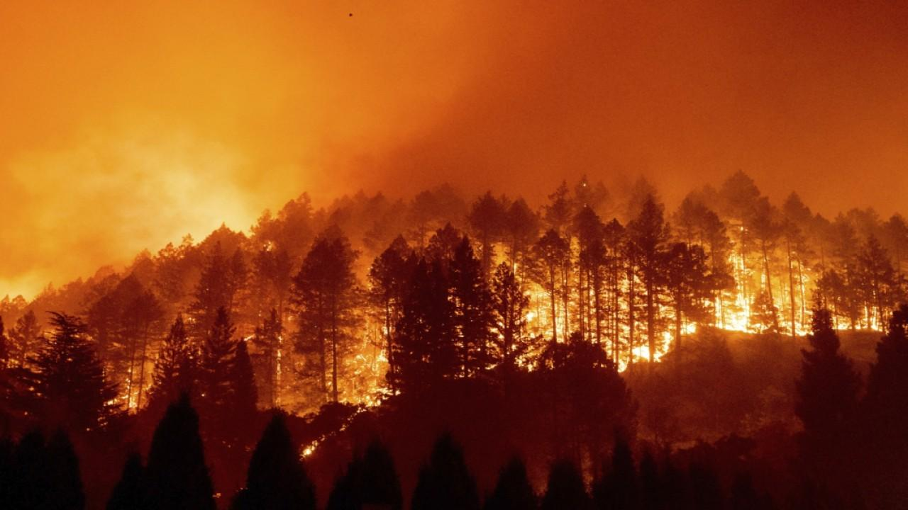
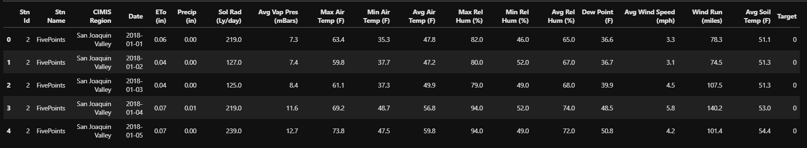
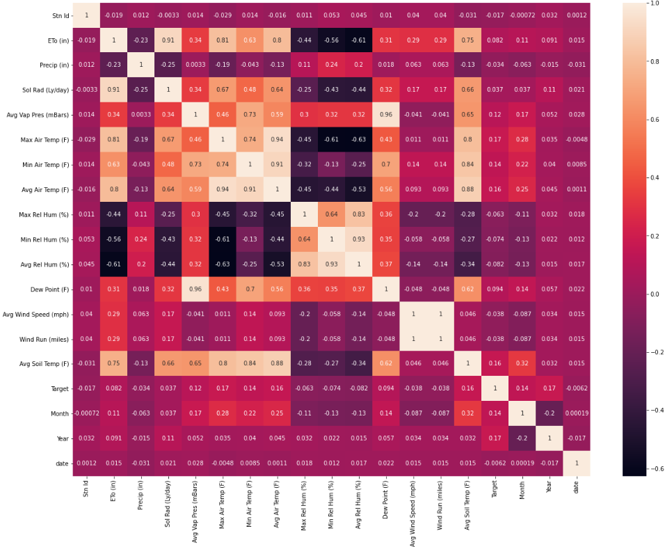
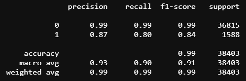
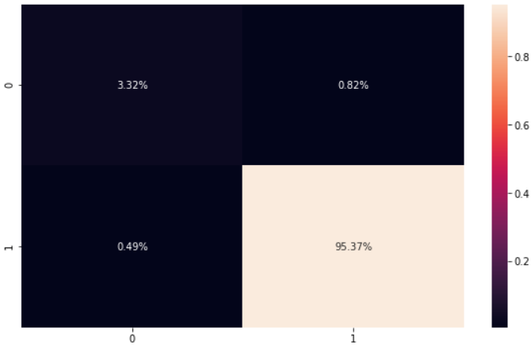

# **California Widfire Prediction**

  

# **About Project**
Data source: https://www.kaggle.com/chelseazaloumis/cimis-dataset-with-fire-target

### **Context**
Explore an environmental conditions dataframe scraped from CIMIS (California Irrigation Management Information System) weather stations using a selenium chromedriver. With California’s wildfires setting records in 2020, it is worthwhile to explore factors that may contribute to creating at risk environments.

Acknowledgements
CIMIS: https://cimis.water.ca.gov/Default.aspx

Column on dataset:
1. Station Id: California weather station IDs
2. Station Name: California weather station names
3. CIMIS region: Regions in California State
4. Date: recorded date
5. ETo (in): Evapotranspiration; is the process whereby liquid water is converted to water vapour (vaporization) and removed from the evaporating surface (vapour removal) (http://www.fao.org/3/x0490e/x0490e04.htm). Water evaporates from a variety of surfaces, such as lakes, rivers, pavements, soils, and wet vegetation. Evapotranspiration unit in inch
6. Precip (m): Precipitation; is water released from clouds in the form of rain, freezing rain, sleet, snow, or hail. Most precipitation falls as rain (USGS gov: https://www.usgs.gov/special-topic/water-science-school/science/precipitation-and-water-cycle?qt-science_center_objects=0#qt-science_center_objects). Precipitation unit in meter.
7. Sol Rad (Ly/day): Solar Radiation; is the heat and light and other radiation given off by the sun (Book, 2002. Source: https://www.sciencedirect.com/topics/chemistry/solar-radiation)
8. Avg Vap Pres (mBars): Average Vapor Pressure; defined as the pressure exerted by a vapor that is in thermodynamic equilibrium with the condensed phase (solid or liquid) at a given temperature in a closed system (2019, Speight. Source: https://www.sciencedirect.com/topics/earth-and-planetary-sciences/vapour-pressure.
9. Max Air Temp, Min Air Tem, Avg Air Temperature: Maximum, minimum, and average air temperature, units in Fahrenheit.
10. Max Rel Hum, Min Rel Hum, Avg Rel Hum: Maximum, minimum, and average relative humidity, units in %%.
11. Dew Point (F); is the temperature to which a parcel of moist air must be cooled at constant atmospheric pressure and constant water vapor content in order for saturation to occur (2019, Camuffo. Source: https://www.sciencedirect.com/topics/earth-and-planetary-sciences/dew-point).
12. Avg Wind Speed (mph): Average wind speed, unit in miles per hour
13. Wind Run (miles): a meteorological term used to categorize or determine the total distance (or amount) of the travelled wind over a period of time. The readings are collected using an anemometer. Wind run can help to determine the rate of evaporation of moisture over a particular area.
14. Avg Soil Temp (F): Average Soil Temperature; the measurement of the warmth in soil.
15. Target: Target column, whether there is wildfires happen (1) or not (0).

# Dataset

#
# **Project Goals**

1. Determine key factors that may contribute on California's wildfires causes.
2. Create machine learning model to predict probability of Wildfire based on input factors.

# **Analysis**

## Statistical Analysis
Pearson Correlation Heatmap

  

From the figure above, it can be seen that features having correlation score higher farthest from 0 (indicates having correlation with target column) are features:
- Avg Vap Pres: 0.12
- Air temperatures; min, max, and average: 0.17, 0.4, 0.16
- Avg Soil temp: 0.16
- Month: 0.14
- Year: 0.17

Suspected factors that are correlated with wildfire are some kind related to temperature, such as air and solid temperatures. That being said, wildfire occurances can be predicted related to Season/Month. Hot/Summer season might likely to have higher potential in wildfire occurrences than cold/wet season.

#
# **Machine Learning Model**
Model algorithm used to build Machine Learning prediction model is XGBoost Classifier, the classification report is as shown below:

  

Confusion Matrix:

  

#
# Conclusion
1. Based on the data, the primary cause of California Wildfires are natural factors related to temperatures, such as air and soil temperatures.
2. Machine Learning model using XGBoostClassifier algorithm gives good evaluation in parameters such precision, recall, f1 score, and overall accuracy. This model can reduce the prediction of false negatif, that there is actually high potential of wildfire that predicted not.